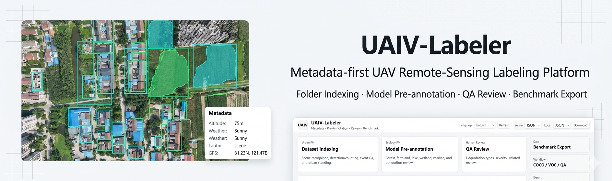
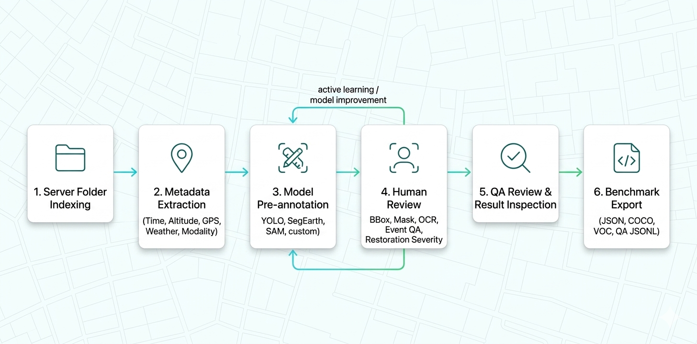
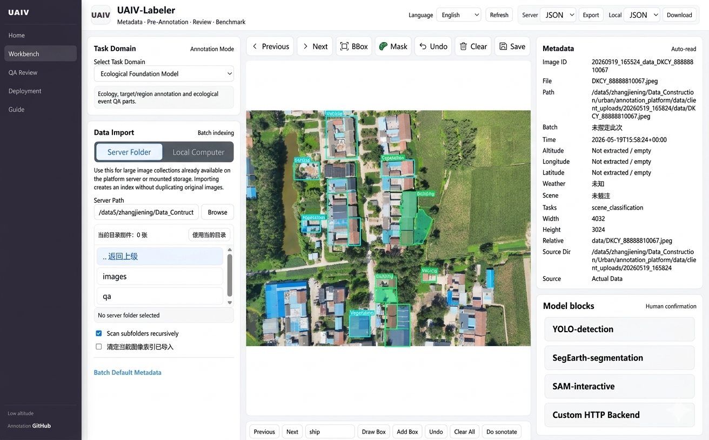
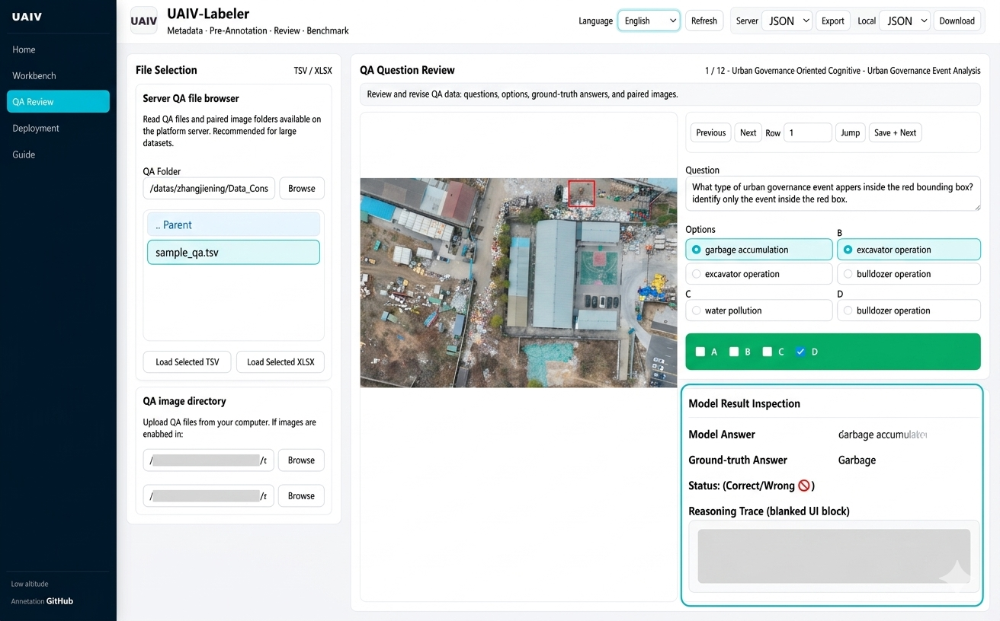
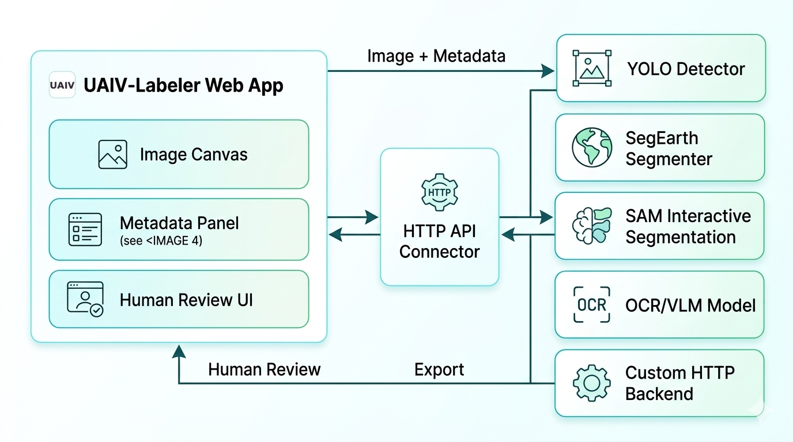
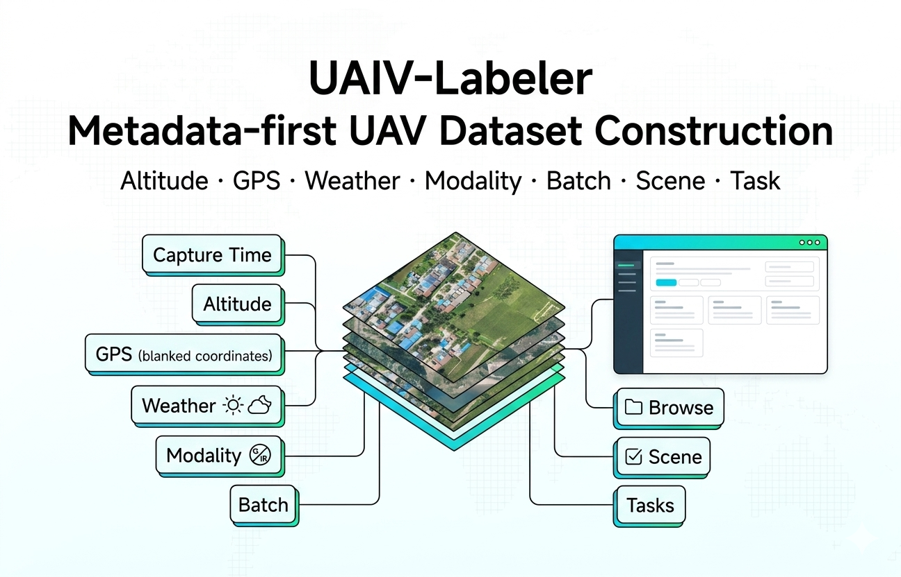
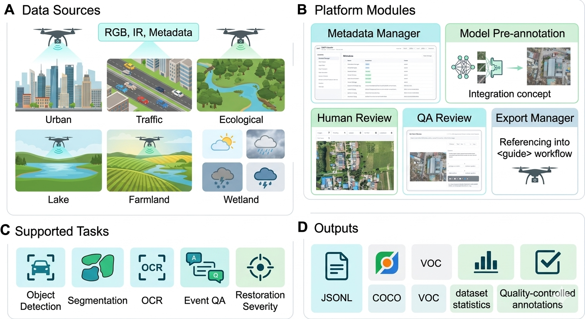
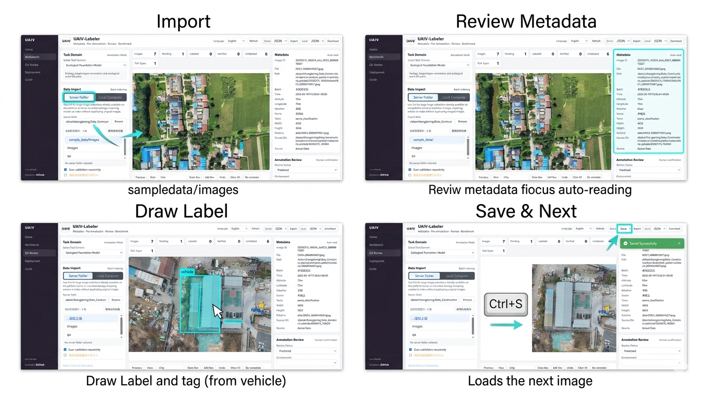
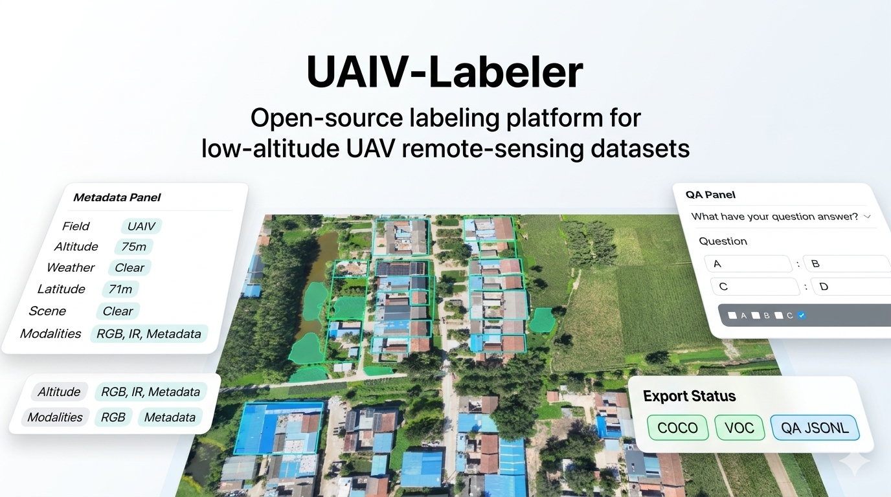
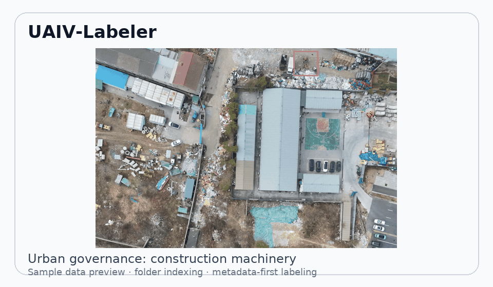

# UAIV-Labeler



**UAIV-Labeler**: a lightweight semi-automatic labeling and annotation workspace for low-altitude UAV remote-sensing datasets.

UAIV-Labeler is the official annotation platform for UAIV-style datasets. It is designed for drone imagery, not just generic image labeling. It indexes server folders without copying large image collections, keeps flight Metadata at the center of the workflow, connects model pre-annotations with human review, and exports training or Benchmark files for urban foundation models, ecological foundation models, and image restoration tasks.

[](https://www.python.org/)
[](https://flask.palletsprojects.com/)
[](https://www.docker.com/)
[](LICENSE)

> Keywords: UAV remote sensing, labeling, annotator, annotation platform, object detection, segmentation, SAM, YOLO, dataset construction, Benchmark, data-centric AI.

[中文说明](README_zh.md)

## Links

- Live demo: http://121.48.163.156:7860
- GitHub repository: https://github.com/JennyZhang0810/UAIV-Labeler
- UAIV dataset project: https://jennyzhang0810.github.io/LowAltitude-Multimodal-Dataset/

## Choose a Run Mode

UAIV-Labeler supports three clearly separated ways to use the platform:

| Mode | Best For | Data Access | Model Access |
| --- | --- | --- | --- |
| **Offline Demo** | Local trial, classroom demo, air-gapped preview | Uses `sample_data/` by default and does not expose a public service | Built-in mock predictions and manual annotation; no heavyweight model weights bundled |
| **Online Live Demo** | Quick public preview | Opens the hosted demo at `http://121.48.163.156:7860`; it can only read demo/server-side data on that host | Uses the backends configured on the hosted server |
| **Server Deployment** | Lab/team production annotation | Runs on your own server or mounted storage, so server-folder import can browse your datasets | Connect local GPU models, remote HTTP model services, or custom backends |

The offline demo is intentionally lightweight. It is not the same as the planned full offline package with bundled model environments and weights.

## Highlights

- **Low-altitude remote-sensing first**: batch, altitude, GPS, weather, scene, source, and task Metadata are built into the annotation flow.
- **No large Web upload required**: server-folder import stores image paths and Metadata indexes instead of duplicating massive UAV datasets.
- **Multi-task workflow**: object detection, segmentation, OCR, event QA, restoration-pair annotation, and structure understanding can be reviewed in one workspace.
- **Model-assisted annotation**: connect YOLO, SegEarth, SAM-style services, OCR, VLMs, or custom HTTP model backends.
- **QA and Benchmark ready**: review TSV QA files, inspect XLSX model results, and export JSON, COCO, VOC, or QA JSONL.
- **GitHub-friendly demo data**: includes a tiny runnable sample dataset so users can try the platform immediately.
- **Offline-friendly entry point**: includes a local-only demo for manual annotation and workflow review without exposing a public server.

## Workflow



## Interface Preview

### Workbench



### QA Review



## Core Capabilities

### Model Integration



### Metadata-first Data Management



<details>
<summary><b>More Visual Assets</b></summary>

### Paper-ready Platform Overview



### Demo Storyboard



### Project Page Hero



### Sample Data Preview



</details>

> Tip: `assets/fig2.png` is designed as the GitHub repository social preview image. Upload it in repository settings: **Settings -> General -> Social preview**.

## Related UAIV Dataset

UAIV low-altitude multimodal dataset:

- Project: https://jennyzhang0810.github.io/LowAltitude-Multimodal-Dataset/
- GitHub: https://github.com/JennyZhang0810/LowAltitude-Multimodal-Dataset/tree/main
- ScienceDB: https://www.scidb.cn/detail?dataSetId=203705443be44f7882bb9ddfd7d401da

This platform is intended as a companion tool for scaling UAIV-style Metadata-first, multi-task data construction.

## Timeline

- **2024-2025**: UAIV dataset construction and first public dataset release.
- **2026.05**: UAIV-Labeler initial public release with Metadata-first indexing, manual bbox review, QA review, export formats, Docker startup, sample data, and a local offline demo.
- **Next**: full offline package for intranet or no-internet environments, improved segmentation workflow, stronger model backend examples, and more task templates.

## Roadmap

- **Offline full package**: provide a self-contained offline bundle for internal networks, no-internet labs, and secure government/enterprise environments. The current repository already includes a lightweight offline demo.
- **Task templates**: add configurable templates for fire/smoke monitoring, illegal dumping, water pollution, construction activity, traffic congestion, illegal parking, vegetation damage, farmland/wetland monitoring, and restoration severity grading.
- **Interactive segmentation**: integrate click/box prompt segmentation through SAM/SAM2/SAM3-style services.
- **Large image support**: improve tiled viewing for large UAV mosaics and GeoTIFF-style imagery.
- **Dataset Card generator**: automatically summarize scenes, weather, altitude, tasks, review status, and export statistics.
- **Collaboration support**: move from JSON files to SQLite/PostgreSQL for multi-user review and audit trails.
- **Community task support**: if you need a specific UAV or remote-sensing labeling workflow, please open an issue or contact the maintainer.

Contact:

```text
202421080308@std.uestc.edu.cn
```

## Quick Start

### Offline Demo

```bash
git clone https://github.com/JennyZhang0810/UAIV-Labeler.git
cd UAIV-Labeler
pip install -r requirements.txt
bash offline_demo/run_offline.sh
```

Open:

```text
http://127.0.0.1:7860
```

Try the built-in sample data:

```text
sample_data/images
sample_data/qa/sample_qa.tsv
```

Windows users can run:

```text
offline_demo\run_offline.bat
```

The offline demo binds to `127.0.0.1` and is visible only on the current computer. See [docs/OFFLINE_DEMO.md](docs/OFFLINE_DEMO.md).

### Online Live Demo

Open the public preview:

```text
http://121.48.163.156:7860
```

This address is for previewing the hosted service. It cannot browse a visitor's private C/D/F drive or another team's server disks.

### Server Deployment

For a server or lab workstation:

```bash
URBAN_ANNOTATION_HOST=0.0.0.0 URBAN_ANNOTATION_PORT=7860 bash scripts/start_public.sh
```

Share:

```text
http://<server-ip>:7860
```

`127.0.0.1` is only visible inside the machine running the service. Do not share it as a public address.

## Docker

```bash
docker compose up --build
```

Open:

```text
http://localhost:7860
```

To use your own dataset, mount it as `/datasets` in `docker-compose.yml`, then import `/datasets/...` in the server-folder panel.

## Data Access Model

Two import modes are supported:

- **Server folder**: reads paths on the machine that hosts the platform. Best for large UAV datasets on lab servers or mounted storage.
- **Local computer**: uploads files from the browser user's computer. Best for small trials or supplemental batches.

Runtime path configuration:

```bash
export UAIV_BROWSE_ROOTS="/datasets:/mnt/uaiv:/your/data/root"
export UAIV_DEFAULT_BROWSE_PATH="/datasets"
export UAIV_QA_ROOT="/datasets/qa"
```

## Custom Model Backend

Start the minimal example backend:

```bash
pip install flask
python examples/custom_model_backend.py
```

Then set the UI custom model URL to:

```text
http://127.0.0.1:9001/predict
```

Expected response:

```json
{
  "objects": [
    {"label": "vehicle", "bbox": [120, 80, 60, 40], "score": 0.91, "origin": "model"}
  ],
  "segments": [],
  "ocr": [],
  "events": []
}
```

More details: [docs/CUSTOM_MODEL.md](docs/CUSTOM_MODEL.md)

## Repository Structure

```text
app/                    Flask backend and static frontend
config/                 Model, storage, and training-hook config
sample_data/            Tiny public demo dataset
examples/               Minimal custom model backend
docs/                   Deployment, architecture, and release docs
offline_demo/            Local-only offline demo launcher
assets/                 README banner, workflow diagram, demo storyboard
data/                   Runtime metadata and annotations
exports/                Runtime export outputs
deploy/                 Nginx/systemd examples
scripts/                Launch and helper scripts
```

## Documentation

- [User Guide](USER_GUIDE.md)
- [中文说明](README_zh.md)
- [Deployment](docs/DEPLOYMENT.md)
- [Offline Demo](docs/OFFLINE_DEMO.md)
- [Offline Demo Quick Start](offline_demo/README_OFFLINE.md)
- [Architecture](docs/ARCHITECTURE.md)
- [Custom Model Backend](docs/CUSTOM_MODEL.md)
- [Regression Checklist](docs/REGRESSION_CHECKLIST.md)
- [Release Checklist](docs/RELEASE_CHECKLIST.md)
- [Demo GIF Storyboard](assets/demo_storyboard.md)

## Demo GIF

Before the first public release, record a short GIF and save it as:

```text
assets/demo.gif
```

Suggested 15-second sequence:

1. Open the platform.
2. Import `sample_data/images`.
3. Select an image and show Metadata.
4. Draw a bbox.
5. Press `Ctrl+S` and move to the next image.

## Roadmap

- Interactive SAM/SAM2/SAM3 prompt segmentation service.
- Large GeoTIFF tile viewer with OpenSeadragon or Leaflet.
- SQLite/PostgreSQL storage for multi-user annotation.
- Active learning queue and low-confidence review priority.
- Dataset Card auto-generation.
- More Benchmark templates for urban and ecological foundation models.

## Citation

If you use this platform, please cite the UAIV dataset/project and the related paper once available. The ScienceDB record is listed above. Add the final DOI here after publication.

## License

This repository is released under the [MIT License](LICENSE).
